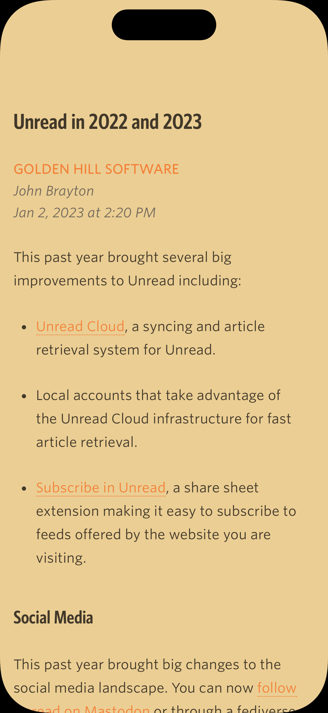
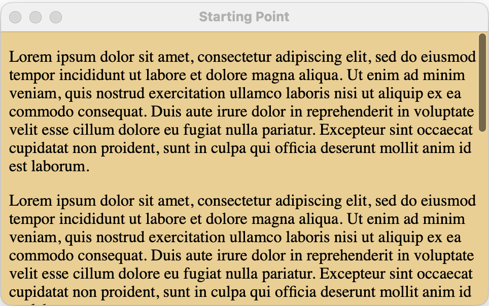
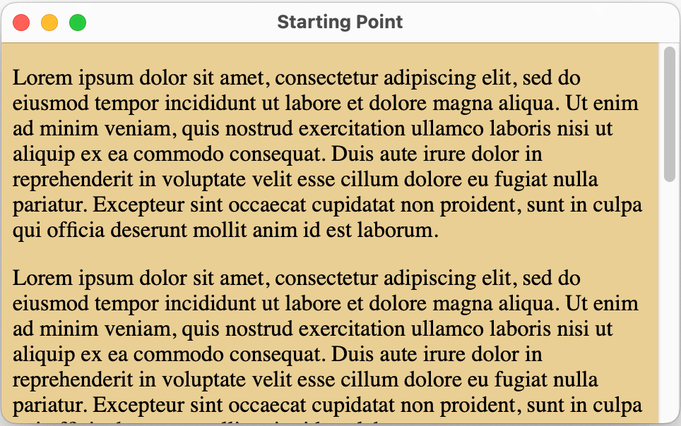

# Scrollers

This is a sample project that attempts to demonstrate an issue I am facing with [Unread](https://www.goldenhillsoftware.com/unread/) on macOS trying to apply color themes to scrollers of `WKWebView` instances.



I am working on bringing Unread to macOS. Unread on macOS will have the same themes, and those themes should apply throughout the Unread user interface on macOS.

But System Preferences has a _Show scroll bars_ setting that can be set to _Automatically based on mouse or trackpad_, _When scrolling_, or _Always_. If set to _When scrolling_, a scrollable webview where the content has a custom background color might look like this when a webview is scrolling:



When the webview is not scrolling, the drag handle will be hidden. That looks fine.

But when the setting is set to _Always_, the webview looks like this:



The scroller has a white background even though the web content has a yellow background. I am looking for a way to give the scroller the same background color as that of the webview.

## CSS Scroller Approach

The `-webkit-scrollbar` pseudo-element provides the ability for a scroller to be styled via CSS. The CSS below provides a reasonable approximation of a standard macOS scroller on a yellow background, but it varies in one important respect. The CSS can specify one color for the scroller knob when the mouse is hovering over it, and a different color for the scroller knob when the mouse is not hovering it.

On macOS a scroller knob changes color when the mouse hovers over any part of the scroller, not just the knob. The knob only changing color when the user hovers over the knob does not feel right on macOS.

A selector of `::-webkit-scrollbar:hover
::-webkit-scrollbar-thumb` or `::-webkit-scrollbar-track:hover
::-webkit-scrollbar-thumb` does not seem to work. Is there another way
I can get the thumb to have a different color when the mouse is over
any part of the scroller?

```css
::-webkit-scrollbar {
    width: 15px;
}

::-webkit-scrollbar-track {
    box-shadow: inset 0 0 10px 10px transparent;
}

::-webkit-scrollbar-thumb {
    box-shadow: inset 0 0 10px 10px #00000038;
    border-left: solid 4px transparent;
    border-right: solid 3px transparent;
    border-top: solid 3px transparent;
    border-bottom: solid 3px transparent;
    border-radius: 15px;
}

::-webkit-scrollbar-thumb:hover {
    box-shadow: inset 0 0 10px 10px #00000080;
}
```

## A custom NSScroller

Another approach is to hide the webview’s scroller, and create a standalone `NSScroller`. The `NSScroller` gets the content size and current scroll state using a JavaScript message handler. When the `NSScroller` knob is moved, the app can tell the webview to change its scroll position by executing JavaScript. 

I got this working pretty well with one important exception: when Low Power Mode is enabled on the Mac, the scroll knob does not scroll smoothly when swiping via trackpad. The problem appears to be that the JavaScript `onscroll` handler is only able to pass messages to the message handler with just about 0.33 milliseconds between requests – too slow to update the scroll position of the knob at 60 frames/second. _This is on my 2019 16-inch MacBook Pro. 

Perhaps the performance characteristics would be different on slower or faster hardware Or perhaps scrolling would be janky even when Low Power Mode is off on an older Mac. I don't know.

---

The sample project in this repository demonstrates the issue I am facing. If you compile and run it, the app creates 3 windows:

**Starting Point:** A window whose webview has a scroller that is not themed when the “Show scroll bars” System Preferences setting is set to “always”.

**CSS Scroller:** A window whose webview has a themed scroller that highlights when the mouse hovers over the knob but not any other part of the scroller.

**Custom Scroller:** A window whose webview has a themed scroller that scrolls in a janky manner when Low Power Mode is on.

---

Relevant feedback: `FB12186925`: WKWebView - customizing scroll bar